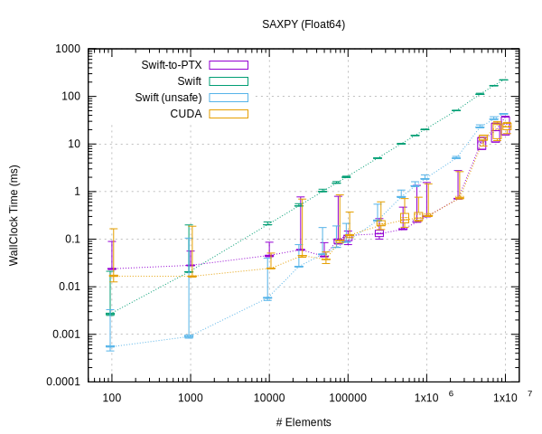
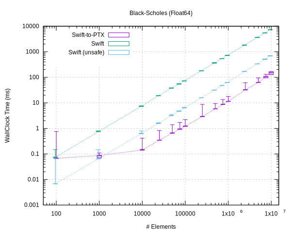

# Swift-to-PTX

Lift Swift code to parallel CUDA kernels.

## Adding it to your project

Add to your `Package.swift`:

```swift
    dependencies: [
        .package(url: "git@gitlab.com:PassiveLogic/compiler/swift-to-ptx.git", revision: "0.2")
    ]
```

## Adding it to your code

In a module containing a loop(s) that you wish to hoist to the GPU:

```swift
import SwiftToGPU
```

and replace `for` loops with the provided `parallel_for` construct. Example:

```swift
func nondeterministicIndex(of target: Float, in array: [Float]) -> Int?
{
    var index : Int? = nil
    parallel_for(iterations: array.count) { i in
        if array[i] == target {
            index = i
        }
    }.sync()        // wait for the GPU to finish before proceeding
    return index
}
```

The `parallel_for` function takes a closure that is given an index in the range
`0..<iterations`, with which the loop body can do something to compute a result,
closing over captured variables. In principle all of the loop iterations are
executed concurrently in data-parallel, and thus must all be independent of one
another. The above example then is non-deterministic because if the target value
exists in multiple positions in the array, the function may return a different
index each time it is called.

Note that any data to be filled-in must be pre-allocated at the (maximum) size
required _before_ entering the parallel section: avoid using inherently
sequential operations such as Array.append(). (You should (almost) never be
using that anyway: figure out what the requirements of your program are
instead!)

## Building

You will need to compile your project with a swift toolchain that includes the
swift-to-ptx compiler transformation, e.g. available from here:

https://gitlab.com/PassiveLogic/compiler/swift

Note that the transformation is only enabled when compiling with optimisations
(release mode).

There are two ways to set up the development environment:

### Container

This is a self-contained development environment that uses the same Docker image
used by CI for local development. Beyond the benefits of [dev/prod
parity](https://12factor.net/dev-prod-parity), this approach may be easier to
set up. No additional toolchain or dependencies are necessary when using the
container.

1. Install Podman for your operating system:
  * [Podman CLI](https://podman.io/docs/installation)
  * [Podman Desktop](https://podman-desktop.io/docs/installation)

> [!warning]
> Make sure to follow the installation instructions carefully. If you do not have
> a working *Podman Machine*, executing the commands below won't be possible.

2. Verify that Podman is installed and running correctly
   ```
   podman --version
   ```

3. Once this is done, the container can be started with the `podman run`
   command. For example, to launch an interactive container:
   ```
   podman run --rm -it \
     -v $PWD:/root  \  # make the current directory available in the container
     registry.gitlab.com/passivelogic/compiler/swift:latest \
     /bin/bash
   ```
   but it can be simpler to just run the one command you want, for example:
   ```
   podman run -v $PWD:/root registry.gitlab.com/passivelogic/compiler/swift:latest \
     swift build -c release
   ```

   Building executables with the `--static-swift-stdlib` option is useful when
   copying the resulting executable to a remote executor.


### Native

Building the compiler is [as
usual](https://github.com/swiftlang/swift/blob/main/docs/HowToGuides/GettingStarted.md),
with the addition that LLVM must be built with the NVPTX backend, e.g.:
```
./utils/build-script --llvm-targets-to-build "AArch64;NVPTX" ...
```

## API

A number of the usual data-parallel array operators are available from the
[Prelude.swift](/Sources/swift-to-ptx/Prelude.swift) module. It is expected that
this will grow (and change) rapidly as the project continues.


## Command line options

There are several command line options that can be used to control the behaviour
of the transformation.

  * `--swift-to-ptx-verbose[=BOOL]`
  Use verbose output (false).

  * `--swift-to-ptx-keep-intermediate-files[=BOOL]`
  Keep intermediate files (false). Use this to see what code was generated.

  * `--swift-to-ptx-ptxas-path=PATH`
  Path to the `ptxas` executable. Defaults to "/usr/local/cuda/bin/ptxas".

  * `--swift-to-ptx-target-gpu=STRING`
  Generate code for this specific GPU architecture. Defaults to "sm_87" (NVIDIA
  Jetson Orin).

  * `--swift-to-ptx-target-attr=STRING`
  Target specific attributes to add during compilation. Defaults to "+ptx81"
  (NVIDIA Jetson Orin).

  * `--swift-to-ptx-allow-fp-arcp[=BOOL]`
  Allow floating-point division to be treated as multiplication by a
  reciprocal (true).

  * `--swift-to-ptx-allow-fp-contract[=BOOL]`
  Allow floating-point contraction, e.g. fusing a multiply followed by an
  addition into a fused multiply-add (true).

  * `--swift-to-ptx-allow-fp-afn[=BOOL]`
  Allow substitution of approximate calculation for functions, e.g. sin, log,
  sqrt, etc. (true).

  * `--swift-to-ptx-allow-fp-reassoc[=BOOL]`
  Allow re-association transformations for floating-point operations (true).

  * `--swift-to-ptx-device-debug[=BOOL]`
  Include debug information in device code (false). Requires compiling the Swift
  module with debug information as well.

Note that these options must be passed through to the LLVM phase of compilation.
For example, you can add them to your `Package.swift` as:

```swift
    swiftSettings: [
        .unsafeFlags([
            "-Xllvm", "--swift-to-ptx-verbose"
        ])
    ]
```

## Benchmarks

The following benchmarks were conducted on a NVIDIA Jetson Orin (ARM A78AEv8.2
CPU with 8-cores @ 2GHz, Ampere SM8.7 GPU with 1024 cores in 8 SMs @ 918 MHz)
in MAXN power mode.

### How to interpret the results

The following results are shown using a [box-and-whiskers plot](https://en.wikipedia.org/wiki/Box_plot)
to concisely describe the statistical properties at each data point. The box
represents the [interquartile range](https://en.wikipedia.org/wiki/Interquartile_range),
the span in which 50% of the samples were collected, with the solid line in the
box marking the median value and the dashed line the average. The whiskers
extending from the box represent the minimum and maximum values observed. From
this, we can visually estimate the degree of dispersion and skewness of the
data.

Along with a realisation in Swift-to-PTX, each benchmark contains a number of
comparative implementations:

  * Implementations on the CPU: a "regular" implementation and an
    "optimised" implementation (labelled "unsafe" due to the use of a so-named
    initialiser function). These bounding lines are not meant to be
    authoritative: it may be possible to squeeze more out of the optimised
    implementation, and an unoptimised implementation can be made infinitely
    worse, but the purpose is to give an indication of at what data size is it
    worthwhile to move a computation from the CPU to the GPU.

  * An implementation in raw CUDA (called from Swift, but his should be close
    enough to a raw CUDA/C++ implementation). This gives an indication of the
    overheads incurred implementing GPU kernels in Swift compared to CUDA/C++.
    As the project progresses, we aim to close this gap.


### [SAXPY](./Benchmarks/benchmark-functions/SAXPY.swift)

This benchmark implements the classic Level-1 BLAS routine
[SAXPY](https://netlib.org/lapack/explore-html-3.6.1/df/d28/group__single__blas__level1_gad2a52de0e32a6fc111931ece9b39726c.html#gad2a52de0e32a6fc111931ece9b39726c),
which multiplies a vector by a scalar constant and adds it to another vector;
i.e. $z_i = \alpha \cdot x_i + y_i$.
This represents a workload with a high bytes/flops ratio, that is overall
dominated by the cost of data transfer.




### [BlackScholes](./Benchmarks/benchmark-functions/BlackScholes.swift)

This benchmark implements the
[Black-Scholes](https://en.wikipedia.org/wiki/Black–Scholes_model) options
pricing model. This represents a workload that does a reasonable amount of
computation for each byte transferred.




## Limitations

  * All code to be lifted to the device must be present in a single compilation
    unit passed to the LLVM compiler. Unfortunately, due to the way
    optimisations work, this does not always/necessarily correspond to a single
    .swift file.

    In particular, note that the `--enable-testing` flag, which is added
    automatically by `swift test`, will change how optimisations are performed.

  * `--enable-code-coverage` is currently not supported


## TODO

  * Integration with Swift structured concurrency
  * Integration with debugging / profiling tools
  * A mechanism for automatic kernel fusion
  * ...

