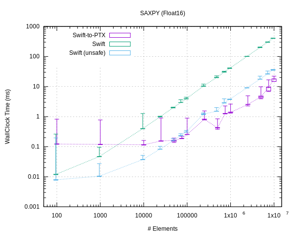
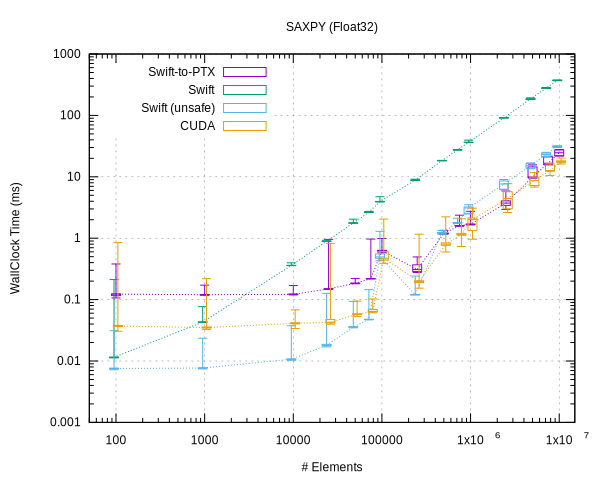
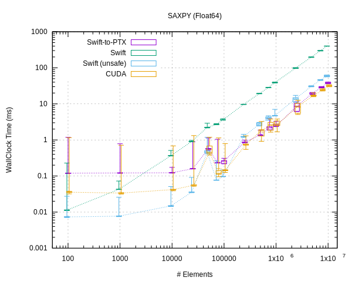
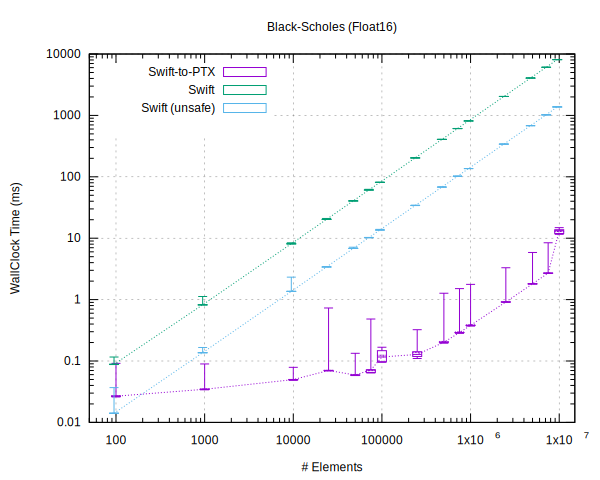
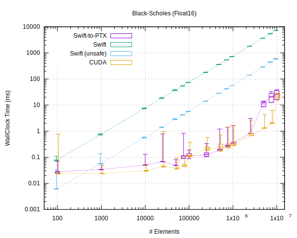
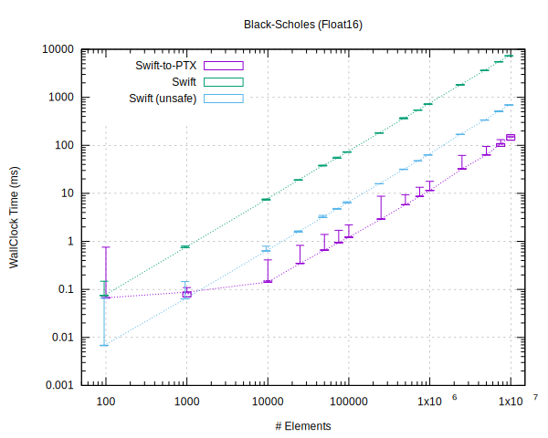

# Swift-to-PTX

Lift Swift code to parallel CUDA kernels.

## Adding it to your project

Add to your `Package.swift`:

```swift
    dependencies: [
        .package(url: "git@gitlab.com/PassiveLogic/Experiments/swift-to-ptx")
    ]
```

## Adding it to your code

In a module containing a loop(s) that you wish to hoist to the GPU:

```swift
import SwiftToPTX
```

and replace `for` loops with the provided `parallel_for` construct. Example:

```swift
func nondeterministicIndex(of target: Float, in array: [Float]) -> Int?
{
    var index : Int? = nil
    parallel_for(iterations: array.count) { i in
        if array[i] == target {
            index = i
        }
    }.sync()        // wait for the GPU to finish before proceeding
    return index
}
```

The `parallel_for` function takes a closure that is given an index in the range
`0..<iterations`, with which the loop body can do something to compute a result,
closing over captured variables. In principle all of the loop iterations are
executed concurrently in data-parallel, and thus must all be independent of one
another. The above example then is non-deterministic because if the target value
exists in multiple positions in the array, the function may return a different
index each time it is called.

Note that any data to be filled-in must be pre-allocated at the (maximum) size
required _before_ entering the parallel section: avoid using inherently
sequential operations such as Array.append(). (You should (almost) never be
using that anyway: figure out what the requirements of your program are
instead!)

You will need to compile your project with a swift toolchain that includes the
swift-to-ptx compiler transformation, e.g. available from here:

https://gitlab.com/PassiveLogic/experiments/swift

Note that the transformation is only enabled when compiling with optimisations
(release mode).

## API

A number of the usual data-parallel array operators are available from the
[Prelude.swift](/Sources/swift-to-ptx/Prelude.swift) module. It is expected that
this will grow (and change) rapidly as the project continues.


## Command line options

There are several command line options that can be used to control the behaviour
of the transformation.

  * `--swift-to-ptx-verbose[=BOOL]`
  Use verbose output (false).

  * `--swift-to-ptx-keep-intermediate-files[=BOOL]`
  Keep intermediate files (false). Use this to see what code was generated.

  * `--swift-to-ptx-ptxas-path=PATH`
  Path to the `ptxas` executable. Defaults to "/usr/local/cuda/bin/ptxas".

  * `--swift-to-ptx-target-gpu=STRING`
  Generate code for this specific GPU architecture. Defaults to "sm_87" (NVIDIA
  Jetson Orin).

  * `--swift-to-ptx-target-attr=STRING`
  Target specific attributes to add during compilation. Defaults to "+ptx81"
  (NVIDIA Jetson Orin).

  * `--swift-to-ptx-allow-fp-arcp[=BOOL]`
  Allow floating-point division to be treated as multiplication by a
  reciprocal (true).

  * `--swift-to-ptx-allow-fp-contract[=BOOL]`
  Allow floating-point contraction, e.g. fusing a multiply followed by an
  addition into a fused multiply-add (true).

  * `--swift-to-ptx-allow-fp-afn[=BOOL]`
  Allow substitution of approximate calculation for functions, e.g. sin, log,
  sqrt, etc. (true).

  * `--swift-to-ptx-allow-fp-reassoc[=BOOL]`
  Allow re-association transformations for floating-point operations (true).

  * `--swift-to-ptx-strip-debug-info[=BOOL]`
  Strip debug information from device code prior to compilation (false).

Note that these options must be passed through to the LLVM phase of compilation.
For example, you can add them to your `Package.swift` as:

```swift
    swiftSettings: [
        .unsafeFlags([
            "-Xllvm", "--swift-to-ptx-verbose"
        ])
    ]
```

## Benchmarks

### SAXPY

This benchmark implements the classic Level-1 BLAS routine
[saxpy](https://netlib.org/lapack/explore-html-3.6.1/df/d28/group__single__blas__level1_gad2a52de0e32a6fc111931ece9b39726c.html#gad2a52de0e32a6fc111931ece9b39726c),
which multiplies a vector by a scalar constant and adds it to another vector;
i.e. $z_i = \alpha \cdot x_i + y_i$.
This represents a workload with a high bytes/flops ratio, that is overall
dominated by the cost of data transfer.





### BlackScholes

This benchmark implements the
[Black-Scholes](https://en.wikipedia.org/wiki/Black–Scholes_model) options
pricing model. This represents a workload that does a reasonable amount of
computation for each byte transferred.





## Limitations

  * All code to be lifted to the device must be present in a single compilation
    unit passed to the LLVM compiler. Unfortunately, this does not exactly
    correspond to a single .swift file...

## TODO

  * ...

